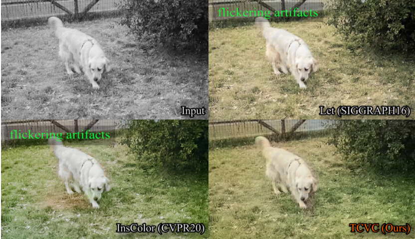
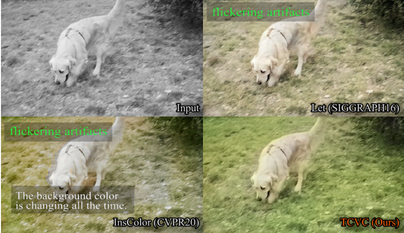
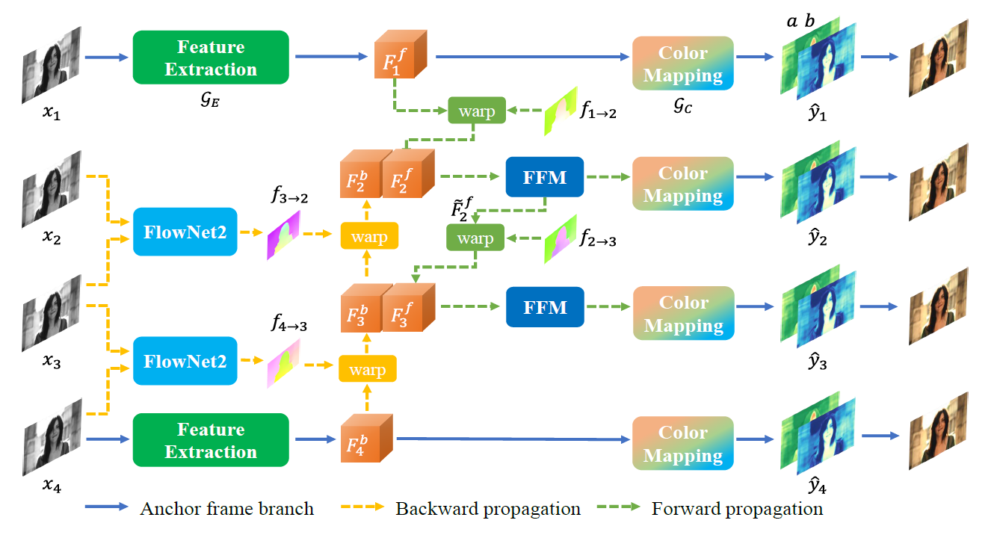

# TCVC-Temporally-Consistent-Video-Colorization

## Temporally Consistent Video Colorization with Deep Feature Propagation and Self-regularization Learning.

[[paper]](https://arxiv.org/pdf/2110.04562.pdf) [[demo]](https://www.youtube.com/watch?v=c7dczMs-olE&t=22s)

Authors: [Yihao Liu\*](https://scholar.google.com/citations?user=WRIYcNwAAAAJ&hl=en&oi=ao), [Hengyuan Zhao\*](https://scholar.google.com/citations?user=QLSk-6IAAAAJ&hl=en&oi=ao), [Kelvin C.K. Chan](https://scholar.google.com/citations?user=QYTu_KQAAAAJ&hl=en&oi=ao), [Xintao Wang](https://scholar.google.com/citations?user=FQgZpQoAAAAJ&hl=en), [Chen Change Loy](https://scholar.google.com/citations?user=559LF80AAAAJ&hl=en), [Yu Qiao](https://scholar.google.com/citations?user=gFtI-8QAAAAJ&hl=en), [Chao Dong](https://scholar.google.com/citations?user=OSDCB0UAAAAJ&hl=en)
\*equal contribution

## News

- [2022/7/21] :zap: We have released the test and training codes! Please refer to the instructions.

## Brief Introduction

Video colorization is a challenging and highly ill-posed problem. Although recent years have witnessed remarkable progress in single image colorization, there is relatively less research effort on video colorization and existing methods always suffer from severe flickering artifacts (temporal inconsistency) or unsatisfying colorization performance. We address this problem from a new perspective, by jointly considering colorization and temporal consistency in a unified framework. Specifically, we propose a novel temporally consistent video colorization framework (TCVC). TCVC effectively propagates frame-level deep features in a bidirectional way to enhance the temporal consistency of colorization. Furthermore, TCVC introduces a self-regularization learning (SRL) scheme to minimize the prediction difference obtained with different time steps. SRL does not require any ground-truth color videos for training and can further improve temporal consistency. Experiments demonstrate that our method can not only obtain visually pleasing colorized video, but also achieve clearly better temporal consistency than state-of-the-art methods.

## Visual Comparison

### Colorization results on legacy black-and-white movies


Image-based colorization method, e.g. InsColor(CVPR2020), tends to bring about severe flickering artifacts with inconsistent colors (highlighted in green rectangles). The colorization effect of video-based method FAVC(CVPR2019) is not satisfactory. Instead, our method can achieve good temporal consistency while maintaining excellent colorization performance.

### Comparison with image-based, video-based and post-processing methods


Image-based methods, like InsColor(CVPR2020), IDC(TOG2017), CIC(ECCV2016), are prone to produce severe flickering artifacts. Post-processing method BTC(ECCV2018) cannot achieve long-term temporal consistency well and cannot handle outliers. The results of FAVC(CVPR2019) are usually unsaturated and unsatisfactory.

### [Video demo](https://www.youtube.com/watch?v=c7dczMs-olE&t=22s)


We also provide a video demo, which can help vividly compare different methods.
[](https://www.youtube.com/watch?v=c7dczMs-olE&t=22s "TCVC demo")

## Method


The proposed TCVC framework (take N=4 for example). The anchor frame branch colorizes the two anchor frames and extracts the deep features for propagation. With bidirectional deep feature propagation, the internal frame features are all generated from anchor frames, which ensures the temporal consistency in high-dimensional feature space.

## Preparation

### Dependencies

- Python >= 3.6
- Tested on PyTorch==1.2.0 (may work for other versions)
- Tested on Ubuntu 18.04.1 LTS
- NVIDIA GPU + [CUDA](https://developer.nvidia.com/cuda-downloads) (Tested on cuda10.0)

### Compile and install some customized packages

In our implementation, we use [FlowNet2](https://github.com/NVIDIA/flownet2-pytorch) as a pretrained flow estimation module.
Please follow the instructions to install the required packages:

```
cd codes/models/archs/networks/channelnorm_package/
python setup.py develop
```

```
cd codes/models/archs/networks/correlation_package/
python setup.py develop
```

```
cd codes/models/archs/networks/resample2d_package/
python setup.py develop
```

### Dataset

#### Training dataset

We mix the training sets of DAVIS and Videvo datasets together for training.
[[Baidu Disk]](https://pan.baidu.com/s/1n3jECI5tvp8Hj2UvJU1yvw) (token: scc7)
Note: All the frames are resized to 300x300 resolution.

#### Test dataset

We use the test sets of DAVIS and Videvo datasets for quantitative evaluation.
DAVIS [[Baidu Disk]](https://pan.baidu.com/s/1vDnqHgRyj23knX6HDw-uEw) (token: tpsx)
Videvo [[Baidu Disk]](https://pan.baidu.com/s/1C0KL9Ld1rbJt5bi7RA1AkQ) (token: h4uy)

#### Custom test dataset

You can test your own dataset as well. More details are described in the Quick Test section.

### Pretrained Models

1. Download the pretrained FlowNet2 model and image-based colorization backbone model at [[Baidu Disk]](https://pan.baidu.com/s/1hIOAO7iiz2J06K2ts7f1Xw) (token: dgiy). Put the downloaded models in the `experiments/pretrained_models/` folder.
2. Download the pretrained TCVC model at [[Baidu Disk]](https://pan.baidu.com/s/1eSCUCfXjsDeLC5-qGytuiA) (token: z8f4). Put the downloaded model in the `experiments/` folder. (Now we only support TCVC model with IDC backbone)

Note: For non-Chinese users, use this S3 bucket:

```
wget https://tcvc.s3.amazonaws.com/TCVC_IDC.zip # Colorization backbone model
wget https://tcvc.s3.amazonaws.com/pretrained_models.zip # Pretrained TCVC
```

## Quick Test

Enter the `code` directory.
[1] If ground-truth colorful video is available:
a. one sampling

```
python test_TCVC_onesampling.py
```

b. multiple sampling ensemble strategy

```
python test_TCVC_multisampling.py
```

Note: the code will first convert the ground-truth colorful video into gray video, then the network will output the predicted colorized video, after which the PSNR will be calculated. This mode is mainly used to quantitatively evaluate the difference between the predicted results and the original color version.

[2] If there is no ground-truth colorful video:

```
python test_TCVC_onesampling_noGT.py
```

Note: In this mode, you can test the model with your own grayscale video. The grayscale video can be three channel or only one channel.
Test settings like `GPU`, `input folder`, `model path`, `interval length`, etc, can be specified in the above test scripts.

## Training

Specify the training configurations in `codes/options/train/train_TCVC_IDC.yml`.
Running the following command:

```
python train_TCVC.py -opt options/train/train_TCVC_IDC.yml
```

## Miscellaneous

1. We also provide a script `eval_results.py` to help evaluate the results.
2. To facilitate comparison, we also provide the output results of several methods and our method. Download link: [[Baidu Disk]]() (token: ) # to be updated

## Citation

If you find our work is useful, please kindly cite it.

```BibTex
@article{liu2021temporally,
  title={Temporally Consistent Video Colorization with Deep Feature Propagation and Self-regularization Learning},
  author={Liu, Yihao and Zhao, Hengyuan and Chan, Kelvin CK and Wang, Xintao and Loy, Chen Change and Qiao, Yu and Dong, Chao},
  journal={arXiv preprint arXiv:2110.04562},
  year={2021}
}
```
